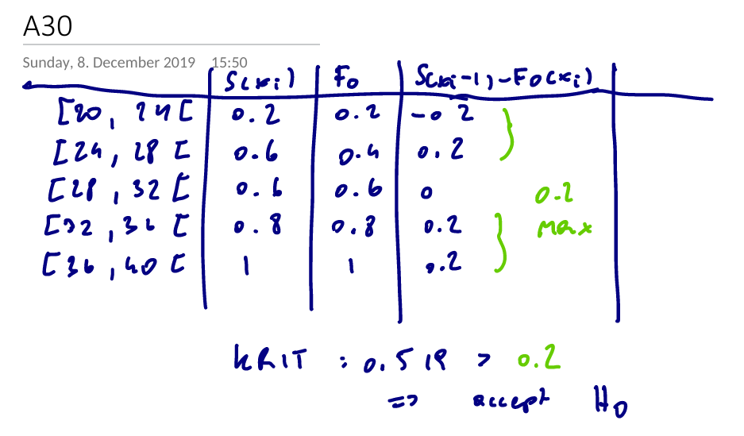

```{r}
library(data.table)
```
```{r}
set.seed(1)
v1 = rnorm(n = 5, mean = 30, sd = 3)
v2 = runif(n = 5, min = 20, max = 40)
v3 = rnorm(n = 50, mean = 30, sd = 3)
v4 = runif(n = 50, min = 20, max = 40)
```
```{r}
data.table(v1=v1, v2=v2)
head(data.table(v3=v3, v4=v3))
```
# Tests
```{r}
ks.test(v1, "pnorm", 30, 3)
```
```{r}
ks.test(v1, "punif", 20, 40)
```
```{r}
ks.test(v2, "pnorm", 30, 3)
```

Manual Test:



Double Check:
```{r}
ks.test(v2, "punif", 20, 40)
```
```{r}
ks.test(v3, "pnorm", 30, 3)
```
```{r}
ks.test(v3, "punif", 20, 40)
```
```{r}
ks.test(v4, "pnorm", 30, 3)
```
```{r}
ks.test(v4, "punif", 20, 40)
```

